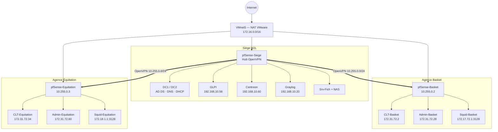

# M2L Infrastructure Lab

Projet personnel d'infrastructure systèmes et réseaux multi-sites, réalisé sous VMware Workstation et documenté de bout en bout.

**Statut :** terminé — 7/7 sprints — 100 %  
**Périmètre :** siège + agence Basket + agence Équitation  
**Objectif :** concevoir, déployer, superviser et durcir une infrastructure virtualisée cohérente, avec services Windows/Linux, VPN inter-sites, inventaire, supervision et centralisation des logs.

> Ce dépôt est une version publique et assainie du lab. Les secrets, clés privées, mots de passe, communautés SNMP réelles et exports de configuration sensibles ne sont pas publiés.

## Vue d'ensemble



L'architecture repose sur un **hub OpenVPN au siège** et deux agences distantes. Le routage inter-sites est effectué sans NAT entre les sites. Les services centraux restent au siège et les agences les consomment via le tunnel.

[Voir les diagrammes GitHub natifs](docs/diagrams/README.md)

## Compétences et technologies mises en œuvre

- Active Directory Domain Services, DNS et DHCP sous Windows Server 2022
- segmentation réseau et filtrage avec pfSense CE 2.9.0
- OpenVPN site-à-site en topologie hub-and-spoke
- relais DHCP Linux avec `isc-dhcp-relay`
- proxy explicite Squid avec blocage du Web direct depuis les LAN agences
- partages SMB et permissions NTFS
- sauvegarde de fichiers vers OpenMediaVault avec Robocopy
- inventaire et gestion de parc avec GLPI 11 + GLPI Agent 1.19
- supervision ICMP/SNMP avec Centreon 25.10
- centralisation des logs avec Graylog 7.1, OpenSearch et MongoDB
- durcissement des flux inter-sites et tests de non-régression
- snapshots de clôture homogènes sur l'ensemble des VMs

## Architecture réseau

| Zone | Réseau | Usage |
|---|---|---|
| VMnet1 / VLAN114 | `192.168.10.32/28` | LAN utilisateurs siège |
| VMnet2 / VLAN115 | `192.168.10.16/28` | Serveurs siège |
| VMnet3 / VLAN116 | `192.168.10.0/28` | Réservé / non utilisé |
| VMnet4 / VLAN117 | `192.168.10.48/28` | Management / supervision |
| VMnet5 | `172.16.0.0/16` | WAN simulé VMware NAT |
| VMnet6 | `172.17.72.0/24` | DMZ Basket |
| VMnet7 | `172.31.72.0/27` | LAN Basket |
| VMnet8 | `172.18.1.0/24` | DMZ Équitation |
| VMnet9 | `172.31.72.32/27` | LAN Équitation |
| OpenVPN | `10.255.0.0/24` | Tunnel inter-sites |

Les adresses sont exclusivement des plages privées utilisées dans le lab.

## Services principaux

| Service | Technologies | Rôle dans le lab |
|---|---|---|
| Identité | Windows Server 2022, AD DS | domaine `m2l.local`, authentification centralisée |
| DNS / DHCP | Windows Server | résolution interne et DHCP centralisé |
| Fichiers | SMB, NTFS, Robocopy | partages métier et sauvegarde vers NAS |
| NAS | OpenMediaVault | stockage et cible de sauvegarde |
| Firewall / VPN | pfSense, OpenVPN | segmentation, filtrage, routage inter-sites |
| Proxy | Squid | sortie Web explicite des agences |
| Inventaire | GLPI, GLPI Agent | parc, LDAP et inventaires distants |
| Supervision | Centreon, SNMP | disponibilité et métriques système |
| Logs | Graylog, OpenSearch, MongoDB | centralisation et séparation des flux de logs |

## Sécurité et durcissement

Quelques choix illustrés dans le projet :

- aucun NAT entre les sites ;
- flux OpenVPN limités aux besoins identifiés ;
- Web direct TCP/80-443 bloqué depuis les LAN agences ;
- navigation autorisée via Squid TCP/3128 ;
- SNMP limité au poller Centreon ;
- Graylog utilise des inputs/streams séparés par pfSense ;
- accès distant GLPI vers les agents limité à TCP/62354 depuis le serveur GLPI ;
- `httpd-trust` des agents limité à localhost et au serveur GLPI ;
- anciennes règles Windows trop larges désactivées au profit de règles ciblées.

## Résultats de clôture

Les tests finaux ont validé :

- DHCP centralisé des deux agences ;
- DNS et jonction au domaine ;
- secure channel AD ;
- proxy HTTP/HTTPS ;
- GLPI et demandes d'inventaire distantes ;
- supervision Centreon ;
- routage des logs Graylog ;
- connexions OpenVPN Basket `10.255.0.2` et Équitation `10.255.0.3` ;
- absence de régression sur l'agence Basket après ajout d'Équitation.

## Documentation

- [Récapitulatif final public](docs/M2L_recap_v3.0_PUBLIC.md)
- [Diagrammes d'architecture Mermaid](docs/diagrams/README.md)
- [`configs/glpi-agent/`](configs/glpi-agent/) — `httpd-trust` et pare-feu Windows ciblé
- [`configs/snmp/`](configs/snmp/) — exemple `snmpd.conf` assaini
- [`configs/pfsense/`](configs/pfsense/) — matrice de règles et principes de filtrage
- [`configs/openvpn/`](configs/openvpn/) — paramètres d'architecture sans certificats ni clés
- [`scripts/`](scripts/) — exemple de sauvegarde Srv-Fich vers NAS

## Incidents et enseignements

Quelques problèmes réellement rencontrés et résolus :

- DNS externe perturbé par VMware NAT malgré un ICMP fonctionnel ;
- impossibilité d'utiliser le DHCP relay pfSense directement via une interface OpenVPN TUN ;
- erreurs d'alias/source dans certaines règles firewall ;
- route OpenVPN temporairement perdue après assignation manuelle de l'interface tunnel ;
- faux diagnostics causés par des VMs/services simplement arrêtés.

Ces incidents sont détaillés dans le récapitulatif public et dans la documentation complète du projet.

## Arborescence

```text
.
├── README.md
├── LICENSE
├── SECURITY.md
├── .gitignore
├── docs/
│   ├── M2L_recap_v3.0_PUBLIC.md
│   └── diagrams/
├── configs/
│   ├── glpi-agent/
│   ├── openvpn/
│   ├── pfsense/
│   └── snmp/
└── scripts/
```

## Note

Ce projet est un **lab personnel de formation et de démonstration technique**. Les choix d'architecture sont adaptés à ce périmètre virtualisé et ne constituent pas, à eux seuls, une recommandation de déploiement en production.
