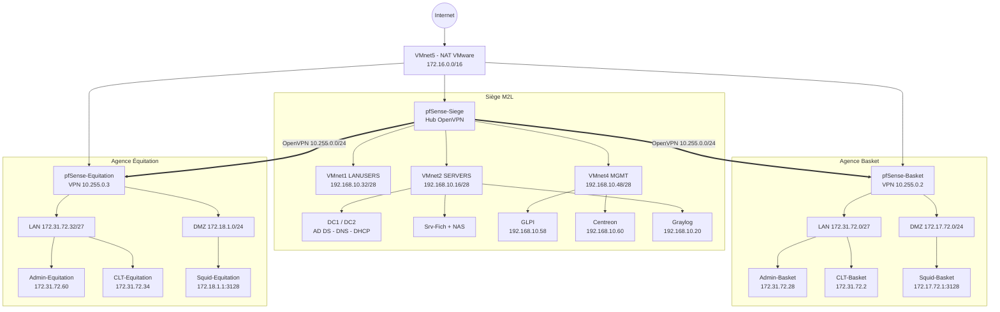
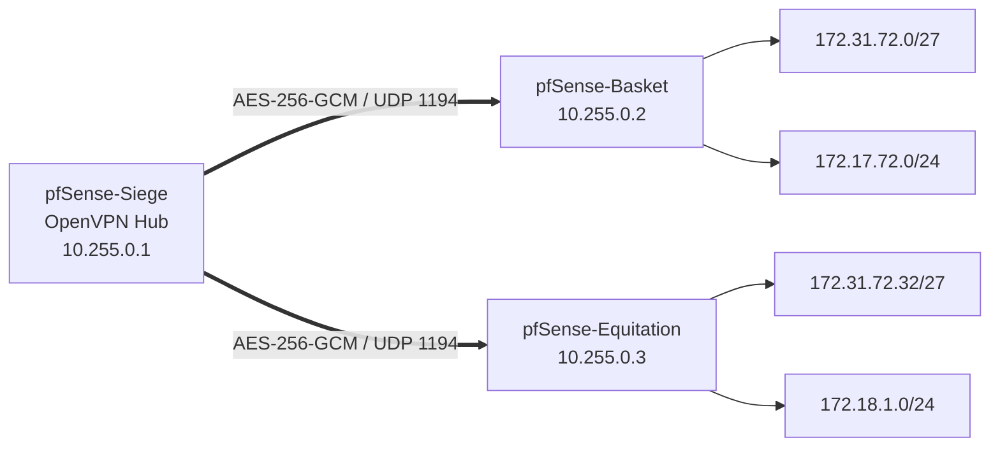
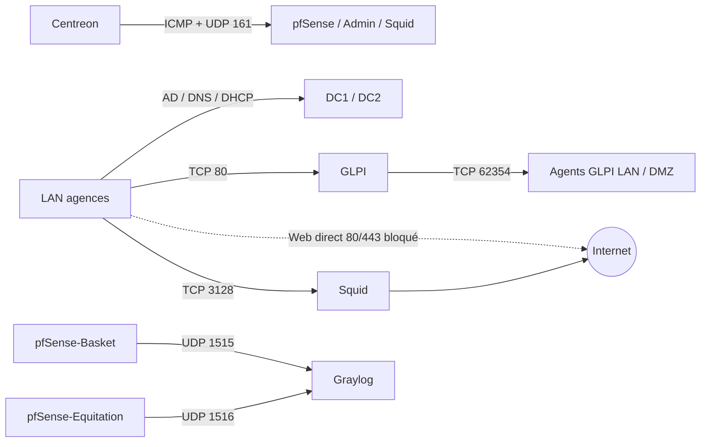

# Diagrammes d'architecture

Les vues ci-dessous sont volontairement maintenues en **Mermaid** afin de rester lisibles directement dans GitHub et faciles à versionner.

## Architecture globale

## OpenVPN hub-and-spoke

## Flux principaux durcis

Les exports PNG/SVG haute résolution de la documentation finale peuvent être ajoutés dans ce répertoire pour les présentations ou les impressions.
